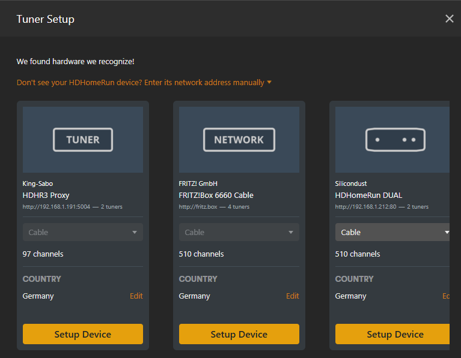

# HDHR3 -> Plex

Makes a legacy HDHomeRun (HDHR3-EU / HDHR3-US / HDHR-US) usable as a Plex tuner,
on Linux or Windows.

Those devices have no HTTP interface — SiliconDust confirmed the hardware can't
do it — and no guide service. Plex needs both. This supplies both:

* emulates the HDHomeRun HTTP API Plex expects
* converts the device's legacy UDP push stream into an HTTP stream
* grabs the DVB EIT off-air and serves it as XMLTV, refreshed in the background

Two Python files, stdlib only. No database, no broker, nothing to compile.

    hdhr3_proxy.py   the bridge — run this
    hdhr3_epg.py     the guide grabber — used by the proxy, also usable alone

## Requirements

Python 3.8 or newer, and `hdhomerun_config` from SiliconDust — nothing else:

    Debian/Ubuntu : apt install hdhomerun-config
    Fedora        : dnf install libhdhomerun
    Arch          : pacman -S libhdhomerun
    Windows       : the HDHomeRun software installer

On Windows, run with `py -3`: `python3` there is often an old or non-native
build, which mangles the device paths passed to `hdhomerun_config.exe`.

## Tested where, exactly

Everything here has been exercised against **one** setup: an HDHR3-EU on
Vodafone cable in North Rhine-Westphalia, Germany (DVB-C, `eu-cable`), feeding
Plex on a QNAP NAS. It works there. Beyond that, assume nothing.

DVB is a family of standards that networks interpret with some latitude, so the
places most likely to need work elsewhere are:

* **Text encoding.** ISO 6937 plus the standard charset selectors are handled.
  UK Freeview's Huffman-compressed strings (encoding 0x1F) are **not** — titles
  and descriptions come back empty on those networks.
* **DVB-T / DVB-T2.** Only `eu-cable` has been used in anger. `eu-bcast`
  tuning is implemented but untested, and an HDHR3 cannot receive DVB-T2 at
  all.
* **Service naming and numbering.** Channel numbers come from the tuner's scan
  and are matched to guide data on `(tsid, service_id)`. Networks that number
  or name services unusually may map differently.
* **EIT completeness.** How much schedule data exists, and whether other
  multiplexes are described, is entirely up to the broadcaster.
* **ATSC.** The HDHR3-US and HDHR-US are listed above because they share the
  streaming limitation, but no ATSC device has been tested and the SI parsing
  here is DVB-only — ATSC uses PSIP, which this does not implement.

## Setup — Linux

    sudo ./install.sh                    # -> /opt/hdhr3-proxy, service, hdhr3-proxy user
    sudo nano /opt/hdhr3-proxy/hdhr3-proxy.conf      # DEVICE, SOURCE, OPTIONS
    /opt/hdhr3-proxy/check.sh                  # diagnostic report
    sudo systemctl enable --now hdhr3-proxy
    journalctl -fu hdhr3-proxy

Or without installing anything: edit `hdhr3-proxy.conf`, then `./run.sh`.

## Setup — Windows

0. Use a current Python. On Windows `python3` is often an old or non-native
   build while `python` is current -- `py -3` picks the right one, and the
   .bat files use it. The script refuses to run on anything below 3.8.
1. Edit `DEVICE`, `SOURCE` and `OPTIONS` at the top of `run.bat` and
   `check.bat`. `OPTIONS` is where the lineup filters and `--epg-days` /
   `--epg-dwell` go, so both scripts stay in step.
2. Double-click `check.bat`. It reports what it found and what's missing.
3. Double-click `run.bat` and leave it running.

## Both — connecting Plex

First start does a channel scan (5-20 minutes, once) and then builds the guide.

1. Plex -> Live TV & DVR. The proxy should appear by itself as shown in the
   picture below (with filtered lineup).

   

   If it doesn't, use **"Don't see your HDHomeRun?"** and enter the URL it
   printed, e.g. `http://192.168.1.20:5004`.
2. For the guide choose XMLTV and enter `http://192.168.1.20:5004/epg.xml`.

Find your device ID first with `hdhomerun_config discover`; `FFFFFFFF` uses
whichever device answers first.

## If something breaks

| Symptom | Cause |
|---|---|
| Plex adds the tuner, playback spins then fails | Firewall blocking **inbound UDP**. Windows: allow `python.exe` on the private network. Linux: `ufw allow from <device-ip> proto udp` or open the port range on firewalld. |
| Empty or tiny lineup | Wrong `SOURCE`, or the channels are encrypted (an HDHR3 has no CI slot). |
| Radio stations in the lineup | Only before the first guide grab. They disappear once `services.json` exists. |
| `all N tuners busy` | Only two tuners exist. The guide grabber never takes the last one, but two Plex streams will. |
| Guide is empty | See "Diagnosing an empty guide" below — the per-mux log says which stage failed. |
| No guide.xml yet | It appears after the first mux finishes, then grows. Full run is `muxes x --epg-dwell` — 30 muxes at 90s is 45 min. Watch the console. |
| Stutter on HD channels (Linux) | UDP receive buffer is clamped by the kernel. `sysctl -w net.core.rmem_max=4194304`. |
| `unknown getset variable`, or fewer tuners than the device has | First check the interpreter: an MSYS/Cygwin Python mangles `/tuner0/...` arguments on the way to `hdhomerun_config.exe`. Use `py -3`. If the device really is unresponsive, power-cycle it. |
| SD card wear (Raspberry Pi) | `run.sh` puts the temporary multiplex captures in `/dev/shm`. Point `DATA_DIR` at a USB stick or SSD to move the guide and cache off the card too, and raise `--write-interval` to rewrite them less often. `check.sh` warns when `DATA_DIR` is on `mmcblk`. |
| Tuner never locks (Linux) | The `dvbhdhomerun` kernel module is loaded and holding the device. `rmmod dvbhdhomerun`. |
| Not auto-detected | Port 65001 is taken by a local HDHomeRun service, or a firewall blocks UDP 65001. The manual URL always works. |
| Plex spinner, no playback, Plex requested `?transcode=` | Plex thinks the tuner transcodes. Keep the default `--model HDHR4-2US` (CONNECT, no transcoder) and set the DVR quality to "Original" in Plex. |
| Plex rejects the device | Try `--model HDTC-2US` or `--model HDHR5-4K`. |

`check.sh` tests the last three automatically.

## Options worth knowing

    --allow-radio          keep radio services in the lineup
    --allow-encrypted      keep encrypted services (they will not play)
    --rescan               redo the channel scan
    --data-dir DIR         where muxes.json and guide.xml live
    --epg-interval 12      hours between guide refreshes
    --epg-dwell 90         seconds spent on each multiplex
    --epg-muxes 1          only grab from the first mux (EIT-other often carries
                           the whole network's guide — much faster)
    --no-epg               don't grab a guide at all
    --check                print a diagnostic report and exit
    --name "..."           friendly name Plex displays
    --manufacturer "..."   see Branding below
    --manufacturer-url URL
    --no-discovery         stop answering UDP discovery on 65001
    --device-id XXXXXXXX   override the announced device id
    --port 5004            HTTP port
    --binary PATH          explicit path to hdhomerun_config

`hdhr3_epg.py` still works standalone (`scan` / `grab` / `parse`) if you only
want an XMLTV file.

## Auto-discovery

The proxy answers HDHomeRun UDP discovery on port 65001, so Plex finds it
without you typing an address. It announces a device id derived from yours but
placed in a non-legacy range: libhdhomerun decides "legacy" from the top 12 bits
of the id alone, and `0x122xxxxx` is hardcoded as HDHR3-EU, so re-using the real
id would announce the proxy as exactly the legacy device it exists to replace.
The generated id keeps the checksum libhdhomerun validates.

Your real tuner keeps answering discovery with its own id, so both appear.
Pick the proxy. `--check` prints which id it uses.

Note the proxy answers discovery and HTTP only -- it does not implement the
control protocol, so `hdhomerun_config <proxy-id> get ...` will not work. Use
the real device id for that.

## Branding

What the proxy announces about itself is set entirely by these options:

    --name "..."             friendly name Plex displays
    --manufacturer "..."     Manufacturer, in discover.json and device.xml
    --manufacturer-url URL   ManufacturerURL
    --model HDTC-2US         ModelNumber
    --device-id XXXXXXXX     announced device id

Plex's tuner handling is closed source. `ModelNumber` and `DeviceID` are the
fields it is known to inspect; `Manufacturer` most likely is not. If Plex ever
stops recognising the proxy, the fallback worth trying is the value every other
HDHomeRun emulator reports:

    --manufacturer Silicondust --manufacturer-url https://www.silicondust.com

## Trimming the lineup

Fewer channels means a smaller guide, a faster import, and less clutter.

Beyond tidiness, a smaller guide imports faster — the XMLTV import is
single-threaded and database-bound, which is the worst case for a NAS CPU. Two
or three days across a trimmed lineup is a reasonable starting point there; a
fast x86 server will take considerably more. Increase `--epg-days` until the
import time stops being acceptable.

Channels are written in numeric order, so a guide that is truncated for any
reason loses high-numbered channels rather than the ones you watch.

Three filters apply to the lineup before anything else:

    --exclude REGEX     drop channels whose name matches (repeatable)
    --include REGEX     keep only channels whose name matches (repeatable)
    --channels LIST     keep only these numbers, e.g. "1-49,60,83"

Two more filters use what the broadcast itself declares, so they need no
name lists:

    --no-shopping       drop channels whose EIT tags most airings with content
                        nibble 0xA5, "advertisement / shopping"
    --only-visible      drop services the NIT marks visible_service_flag=0

`--shopping-threshold` (default 0.5) sets what share of a channel's airings
must be shopping before it is dropped. Both depend on `services.json`, so they
take effect after the first guide grab.

Matching is case-insensitive.

### Working out what to keep

Start by looking at what the scan actually found, then narrow. `--check`
applies the filters and exits without touching the tuner, so iterating costs
nothing:

    python hdhr3_proxy.py -d <id> --check                      # everything
    python hdhr3_proxy.py -d <id> --channels 1-49 --check      # a number range
    python hdhr3_proxy.py -d <id> --exclude Shop --check       # by name

Each run prints the surviving count and what was dropped and why:

    lineup: 49 channels (dropped 47 excluded)

Which filter suits depends on how your network numbers things. Where the
channels you want occupy a contiguous block of low numbers — common on
European cable, where shopping and foreign channels are pushed to the high
end — `--channels` is the simplest tool, and unlike the metadata filters it
works on the very first run. Where they are scattered, `--exclude` on the
recurring parts of broadcaster names is easier to maintain, and `--include`
inverts it when you want only a handful.

`--no-shopping` and `--only-visible` need no local knowledge at all. They read
service metadata from `services.json`, which the proxy fills in at startup with
a short read of the NIT and SDT — those tables cycle in about two seconds, and
SDT-other describes the whole network, so twenty seconds on one multiplex is
usually enough:

    bootstrap: reading service info (20s) so the lineup is filtered before Plex sees it
    bootstrap: 213 services described

That means the very first `lineup.json` a consumer sees is already filtered,
with no restart needed. `--no-bootstrap` skips it; `--bootstrap-dwell` and
`--bootstrap-muxes` tune it.

One exception: `--no-shopping` classifies a channel from EIT content nibbles,
which the short read does not collect, so it only starts dropping channels
after the first full guide grab. A channel is judged only once at least five of
its airings have been seen, so a single mislabelled programme cannot remove a
channel.

## How long a grab takes, and the cache

A grab dwells `--epg-dwell` seconds on each multiplex that carries a lineup
channel, so a full pass is roughly `muxes x dwell`. The proxy prints an
estimate when it starts, and rewrites the guide after every mux, so it is
usable well before the run ends.

**Every guide write also saves `epg-cache.json`** — everything parsed off the
air, before any XML exists. That file is the reason a grab only has to happen
once:

    del guide.xml
    <start the proxy as usual>
    epg: rebuilt from cache (3.2h old): 96 channels, 34205 programmes

Capturing EIT is slow because it is real-time radio: the tuner has to sit on
each multiplex and wait for the schedule tables to cycle round. Rendering XML
from what was captured is instant. Separating the two means changes to
filters, `--epg-days`, channel numbering or anything about the XML cost
seconds to try instead of an hour or more per attempt — which matters a great
deal when a consumer is rejecting your guide and you are working out why.

The cache holds parsed events, so it cannot help with changes to the parsing
itself; `--regrab` forces a fresh capture. The scheduled refresh does a real
grab regardless once `--epg-interval` has elapsed.

## Checking a generated guide

`check_guide.py` reads a guide the way a consumer would, independently of the
proxy and of Plex:

    python check_guide.py guide.xml --lineup http://192.168.1.20:5004/lineup.json

It reports well-formedness first — a single invalid character makes a parser
discard everything after it — then channel and programme counts, channels with
no airings, programmes referencing an undeclared channel, overlapping
schedules, the span covered, whether anything is airing right now, where each
channel sits in the file, unusual characters, and which lineup channels have no
guide data. Run it before blaming the consumer.

## Diagnosing an empty guide

Each mux logs bytes captured and sections decoded:

    epg: mux 4/49 386000000 Hz -- 2841216 bytes, sections eit=118 sdt=9 nit=2 [21/23 services on this mux], 61 channels, 3204 programmes total

Read it left to right:

* **`captured 0 bytes`** — the tuner never streamed. The text after it is
  `hdhomerun_config save`'s own output; `resource locked` means something else
  holds the tuner.
* **bytes captured but `eit=0 sdt=0 nit=0`** — data arrived without the SI
  PIDs, so the hardware PID filter is the suspect. Retry with
  `--epg-pids none` and a short `--epg-dwell 20`; unfiltered is tens of
  megabytes per second.
* **`eit=0` but `sdt`/`nit` non-zero** — the filter is fine, that mux carries
  no EIT.
* **a low `[n/m services]` ratio** — the dwell ended before the schedule
  tables cycled round. Raise `--epg-dwell`.

## A consumer shows the guide as empty or partial

Work through these in order:

1. `check_guide.py` — if the file is bad, nothing downstream matters.
2. Channel ids must equal the consumer's channel numbers. The proxy forces
   this, keyed on `(tsid, service_id)`, and reports coverage after each grab:
   `epg: 96 of 97 lineup channels have guide data`.
3. **Give it time.** Importing tens of thousands of airings takes hours on
   slow hardware such as a NAS, and progress indication is not always honest.
   A guide that looks partial an hour in may be complete by the next morning.
   Change one thing, then wait before concluding anything.

## What gets filtered

Encrypted, radio and data services are dropped from the lineup. The channel
scan only flags encryption, and only when the tuner happened to notice, so the
first run filters approximately. Once a guide grab has run the proxy has the
SDT, which gives `service_type` and `free_CA_mode` per service — radio, teletext
and data channels drop out and the lineup rewrites itself. `--check` reports
exactly what was filtered and whether it has SDT data yet.

## Files

    hdhr3_proxy.py        the bridge
    hdhr3_epg.py          EIT -> XMLTV
    check_guide.py        validates a generated guide
    muxes.json            channel scan result (generated)
    services.json         service types from the SDT (generated)
    epg-cache.json        parsed EIT, so the XML can be re-rendered (generated)
    guide.xml             XMLTV guide (generated)
    hdhr3-proxy.conf      settings for the Linux scripts
    run.sh / check.sh     Linux launchers
    install.sh            installs to /opt/hdhr3-proxy + systemd
    hdhr3-proxy.service   systemd unit
    run.bat / check.bat   Windows launchers
